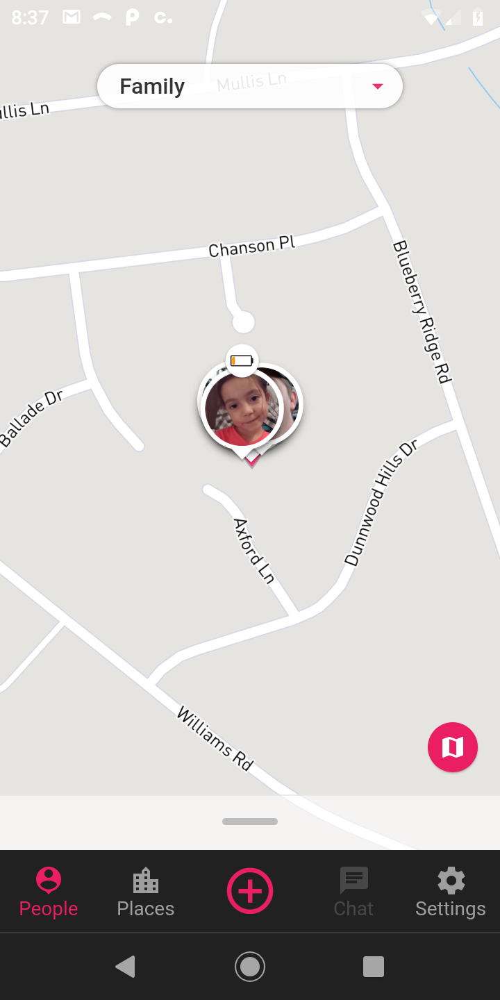

# Flutter Tracker

A Family Tracker for Flutter. This project is only an exercise in re-creating a propular family tracker using Flutter and should not be used for production purposes.



# Firebase

Firebase and firestore are required to run this so make sure to setup a new project.

---

# Style Guide

https://github.com/flutter/flutter/wiki/Style-guide-for-Flutter-repo

---

# VSCode

You will need to install the Dart and Flutter plugins.

  


## launch.json

```json
{
  "version": "0.2.0",
  "configurations": [
    {
      "name": "Flutter_Tracker_DEV",
      "type": "dart",
      "request": "launch",
      "program": "lib/main_dev.dart",
      "args": [
        "--flavor",
        "development"
      ]
    },
    {
      "name": "Flutter_Tracker_PROD",
      "type": "dart",
      "request": "launch",
      "program": "lib/main_prod.dart",
      "args": [
        "--flavor",
        "production"
      ]
    }
  ]
}
```